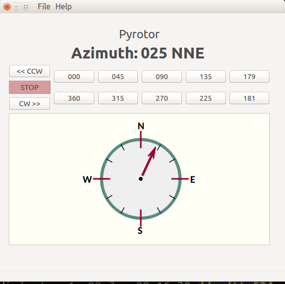
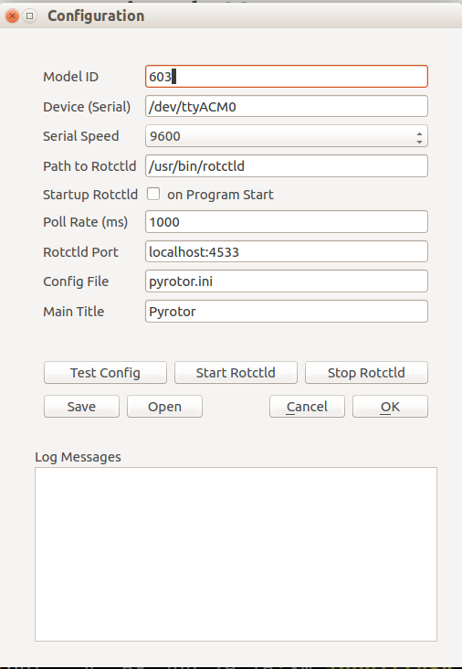
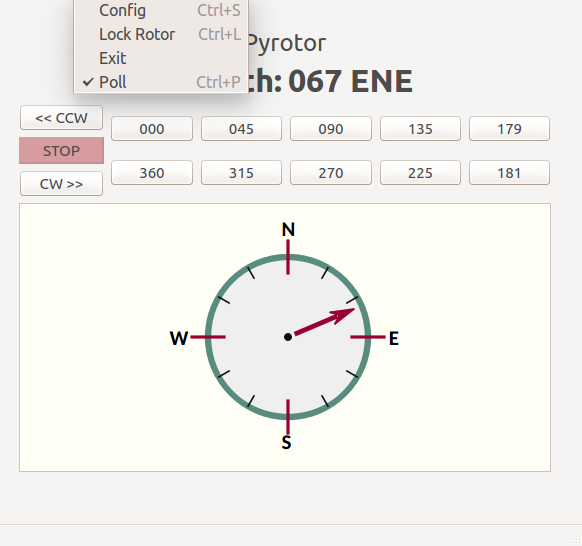
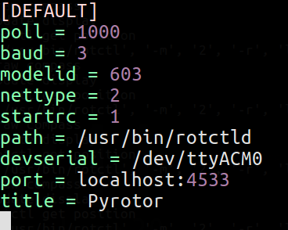
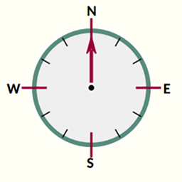

# pyrotor
*Antenna Rotor GUI for Hamlib/RotCtl*

---
## Description
pyrotor is a GUI for the rotctl/hamlib antenna rotor control program [rotctl](http://hamlib.sourceforge.net/manuals/hamlib.html#rotctl). 
This software is designed to work with the excellent [K3NG antenna rotor controller software](https://blog.radioartisan.com/yaesu-rotator-computer-serial-interface/). 

Provides compass display of azimuth, updates via polling, activation and control of rotctld daemon, gui
configuration menu, configuration files (reading and writing), and button rotor control.

Pyrotor uses the rotctl program to communicate with the rotctld daemon, which directly controls and monitors the antenna rotor controller.  

## Command Line Options

to run: `pyrotor [−h|−−help] [−v|−−version] [−d|−−debug] [−c|−−config= ConfigFile]`

### pyrotor cli options

+ -v version  Displays the program version and exits.
+ -h help Displays help and exits
+ -d debug turns on debug logging. default is off, only INFO level messages are logged
+ -c config use the config file for program operation. default is $HOME/.local/pyrotor/pyrotor.ini If the
.local/pyrotor directory does not exist, one will be created on program startup. The .ini files will
be read/written to this directory, unless a different directory is specified by providing a path in the
config file window.

## Configuration File and GUI Settings

see the pyrotor.1 man page and  [pyrotor pdf manual](/doc/pyrotor.pdf) for config file options and settings. 

## Installation

+ Install the required prerequisites
+ copy the pyrotor source code to a directory 
+ run `pyrotor.py`

## Requirements
+ Linux (Ubuntu preferred)
+ python 3.5+
+ pyqt5 
+ libqt5
+ qt designer 
+ hamlib 3.0+ (requires rotctl and rotctld)
+ compliant rotor controller (Yaesu or other hamlib compatible controller)

## Development Notes
pyrotor is developed and tested  on Linux (Ubuntu 16.04, 64bit).  Modifications for other OS environments have not been done. File path conventions for Windows would need major modifications.

The Qt designer application was used to build the GUI template files (\*.ui).  Python files are created by running `pyuic5` to output .py files.  I have included both the .ui and .py files, but you need Qt Designer to regenerate the .py files if you modify them. 

I have also used `pyinstaller` to create a single executiable file, which works on Ubuntu 16.04-64bit. This executable is not included in the repository. 

## License
pyrotor is licensed under MIT License.

## Screenshots

